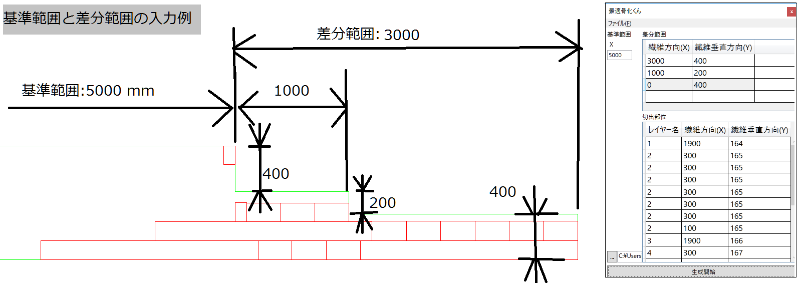
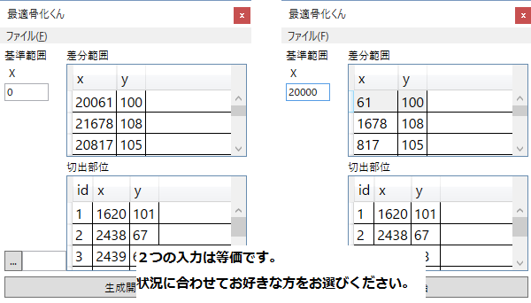

# 最適化骨くん

最適化骨くんは, 桁作成のためにプリプレグから長方形部品を切り出すための図面を生成するシステムです.

**積層パターンは予め用意してください.** これは桁作成のための積層パターンを計算するためのものではありません.

---

## 概要

最適化骨くんは, 桁作成のためにプリプレグから長方形部品を切り出すための図面を生成するシステムですが, 事実上, 長方形内にそれより小さな長方形を複数敷き詰める問題を解くリゾルバです.

実装はヒューリスティクスに行われているため, 常に最適な結果を得られるとは限りません.

`.dxf`形式で図面データを出力します. また生成された図面は, 桁ごとにレイヤー分け/色分けされ出力されます. そのため複数の桁部品を一度に切り出すことができます.

---

## 動作環境

以下の環境で動作検証ずみです.

* OS : Windows10 64-bit
* CAD : 図脳

注意: *図脳* 以外のCADソフトではレイヤーが認識されない場合があります.

---

## How to install

1. ダウンロードした `最適化骨くん.zip` を解答してください.

2. 解答したフォルダにある install.js を起動します.

3. インストールが正常に完了すると *インストールは正常に完了しました* と表示され, `最適化骨くん.lnk` という名前でショートカットが生成されます.

---

## How to uninstall

フォルダごとファイルを削除するとアンインストールされます.

---

## How to use

`最適化骨くん.lnk`をクリックし起動してください.



起動すると, 図の右側のような画面が表示されます.

図の左側は実際に生成される図面の例です.緑線が素材のプリプレグ, 赤線が切り出すプリプレグになります.

主な入力手順は以下の通りです:

1. カーボンシートの寸帽を測ります. (断面がギザギザの場合は基準範囲[^1]を使用すると便利です.)

2. 切り出す長方形部品の縦横の寸法を決めます。

3. [1], [2] の寸法を「最適化骨くん」の「差分範囲([^2])」,「切出範囲」へ入力します.

4. 下部の[...]をクリックし保存ファイル名を入力してください。（保存先の指定と保存ファイル名の指定を同時に行わないとエラーになります。）

入力した寸法をファイルへ保存できます。メニューバー -> ファイル -> (開く | 保存) を選択してください。

（保存ファイルには**差分範囲+基準範囲で保存されます**ので, 保存したファイルを読み込む場合には基準範囲を`0`に設定してください.）

差分範囲, 基準範囲についての具体例を下図に示します.



[^1]: 基準範囲: カーボンシートのギザギザ部分の前部分までの長さを指定できます. 相対的に差分範囲を入力することができます.

[^2]: 差分範囲: ギザギザの部分の範囲です. (ファイル末尾の更新情報 H.27/05/18 を参照)

---

## ファイル構造

```
最適骨化くん
│  GenInputJSON.exe      ...入力フォーム
│  hone.ico              ...アイコン
│  install.js            ...インストールスクリプト
│  Newtonsoft.Json.dll   ...JSONパーサ
│  PazzleClacNative.exe  ...最適化計算プログラム
│  使用上の注意.txt
│  基準範囲と差分範囲の入力例.png
│  基準範囲の入力法.png
│
└─テスト用データ(アプリの動作には関係なし)
        c1.json  ...コックピットフレームテストデータ(1本分)
        c2.json
        c3.json
        c4.json
        c5.json
        c6.json
        シャフト桁6テスト用データ.json ...シャフトテストデータ
        ｺｯｸﾋﾟｯﾄﾌﾚｰﾑ.json             ...コックピットフレームテストデータ
```

---

## 注意

このディレクトリには隠しファイルが含まれています.  
このディレクトリ内のファイルを変更や削除すると正常に動作しなくなる可能性があります. 十分にご注意ください.  
カーボンの寸法が切り出す部品の寸法より小さい場合正常に動作しない場合があります.

---

## 更新情報

- H.27/08/26 追加

  重み係数を設定できるようにしました.  
  重み係数により繊維方向と繊維垂直方向の部品配置の密度が変化します.

- H.27/08/25 修正

  最適化アルゴリズムの大幅修正を行いました.

- H.27/08/21 修正

  入力項目の表示名を変更  
  ドキュメントの更新  
  最適化アルゴリズムのバグを修正  

- H.27/08/20 修正

  保存パスにスペースが含まれていると正常に動作しない不具合を修正しました.  
  最適化アルゴリズムを修正しました.  
  切出部位のみ追加できるようにしました.  
  IDに文字列を指定できるようにしました.  

- H.27/05/18 更新

  差分範囲の順序は下から順に入力してください.  
  これはバグではなく仕様です. なぜならCADの基準点は左下になっているからです.  
  切出範囲は順序関係なく入力できます.
